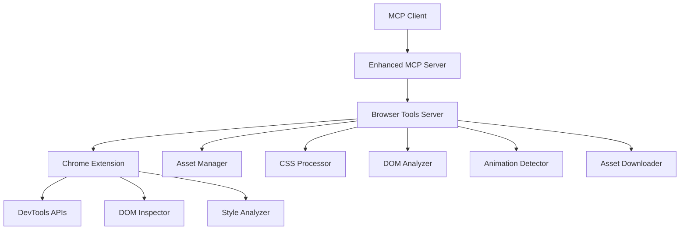

# Website Cloning Enhancement Plan for Browser Tools MCP

## Executive Summary

This document outlines a comprehensive enhancement plan to transform the Browser Tools MCP into a powerful website cloning system capable of capturing complete website designs, CSS animations, hover effects, and all visual/interactive elements. The plan builds upon the existing robust architecture while adding sophisticated DOM analysis, CSS extraction, and asset management capabilities.

## Current Capabilities Assessment

### ✅ **Existing Strengths**
- **Three-tier architecture** with Chrome Extension → Node Server → MCP Server
- **Screenshot capture** for visual documentation
- **Element selection** and basic DOM inspection
- **Network monitoring** for resource tracking
- **WebSocket communication** for real-time data
- **Lighthouse audits** for comprehensive analysis
- **Local processing** ensuring privacy and security

### ⚠️ **Current Limitations for Website Cloning**
- No CSS extraction or computed styles capture
- Limited DOM tree traversal and structure analysis
- No animation/transition state capture
- No hover/focus state detection
- No asset downloading or bundling
- No font/typography extraction
- No responsive design analysis
- No JavaScript interaction capture

## Enhanced Architecture Vision



## New Tool Categories

### 🎨 **1. Visual Analysis Tools**

#### `extractPageStyles`
- **Purpose**: Extract all CSS styles including computed styles
- **Capabilities**:
  - Capture all linked stylesheets
  - Extract inline styles
  - Compute final applied styles for elements
  - Capture CSS custom properties (variables)
  - Extract media queries and responsive breakpoints

#### `captureAnimations`
- **Purpose**: Detect and capture CSS animations and transitions
- **Capabilities**:
  - Identify CSS animations, transitions, and transforms
  - Capture keyframe definitions
  - Record animation states and timings
  - Detect JavaScript-driven animations
  - Capture scroll-triggered animations

#### `analyzeHoverStates`
- **Purpose**: Detect and capture hover/focus/active states
- **Capabilities**:
  - Trigger pseudo-selectors programmatically
  - Capture state changes in styles
  - Document interactive element behaviors
  - Record cursor change patterns

### 🏗️ **2. Structure Analysis Tools**

#### `extractDOMStructure`
- **Purpose**: Complete DOM tree analysis with semantic understanding
- **Capabilities**:
  - Full DOM tree traversal with parent-child relationships
  - Semantic element classification (header, nav, main, etc.)
  - Component boundary detection
  - Layout structure analysis (flexbox, grid, positioning)

#### `analyzeLayoutSystem`
- **Purpose**: Understand the underlying layout methodology
- **Capabilities**:
  - Detect CSS Grid layouts and configurations
  - Analyze Flexbox containers and items
  - Identify positioning strategies (absolute, relative, fixed)
  - Capture spacing systems (margins, padding patterns)

#### `extractTypography`
- **Purpose**: Comprehensive typography analysis
- **Capabilities**:
  - Font family detection and classification
  - Font loading and fallback analysis
  - Text styling patterns (sizes, weights, line-heights)
  - Custom font file identification and extraction

### 📱 **3. Responsive Design Tools**

#### `analyzeResponsiveDesign`
- **Purpose**: Multi-breakpoint design analysis
- **Capabilities**:
  - Simulate different viewport sizes
  - Capture responsive behavior changes
  - Identify breakpoint patterns
  - Document mobile-specific interactions

#### `captureViewportVariations`
- **Purpose**: Screenshot and analyze across multiple device sizes
- **Capabilities**:
  - Automated multi-device screenshots
  - Layout comparison across breakpoints
  - Interactive element behavior on different screens
  - Touch vs. mouse interaction patterns

### 🎯 **4. Asset Management Tools**

#### `downloadPageAssets`
- **Purpose**: Comprehensive asset collection and organization
- **Capabilities**:
  - Download all images, fonts, icons, videos
  - Preserve original file names and folder structure
  - Optimize assets while maintaining quality
  - Generate asset manifest with usage mapping

#### `extractResourceDependencies`
- **Purpose**: Map resource relationships and dependencies
- **Capabilities**:
  - CSS-to-asset mapping
  - JavaScript-to-resource relationships
  - Critical vs. non-critical resource identification
  - Loading priority analysis

### 🔍 **5. Interaction Analysis Tools**

#### `mapInteractiveElements`
- **Purpose**: Identify and document all interactive components
- **Capabilities**:
  - Form element analysis and validation rules
  - Button and link behavior mapping
  - Modal and popup detection
  - Navigation pattern analysis

#### `captureJavaScriptBehaviors`
- **Purpose**: Document JavaScript-driven interactions
- **Capabilities**:
  - Event listener identification
  - Dynamic content generation patterns
  - AJAX/fetch request mapping
  - State management pattern detection

### 🎪 **6. Advanced Cloning Tools**

#### `generateClonePackage`
- **Purpose**: Create complete, deployable website clone
- **Capabilities**:
  - Generate clean HTML structure
  - Consolidate and optimize CSS
  - Create asset bundles with proper paths
  - Generate deployment-ready package

#### `runFullSiteClone`
- **Purpose**: Orchestrated workflow for complete site cloning
- **Capabilities**:
  - Multi-page crawling and analysis
  - Site map generation
  - Cross-page component identification
  - Unified asset management

## Implementation Roadmap

### 🚀 **Phase 1: Foundation Enhancement (Weeks 1-2)**

#### New Chrome Extension Capabilities
```javascript
// Enhanced DOM inspector
const domAnalyzer = {
  extractFullDOM: () => {
    // Complete DOM tree with computed styles
  },
  getComputedStyles: (element) => {
    // All computed CSS properties
  },
  detectAnimations: () => {
    // CSS animations and transitions
  }
};

// Style extraction engine
const styleExtractor = {
  getAllStylesheets: () => {
    // All CSS resources
  },
  getInlineStyles: () => {
    // Inline style extraction
  },
  computeFinalStyles: (element) => {
    // Final computed styles
  }
};
```

#### New MCP Server Tools
```typescript
// Core style extraction
server.tool("extractPageStyles", {}, async () => {
  // Implementation
});

// DOM structure analysis
server.tool("extractDOMStructure", {}, async () => {
  // Implementation
});

// Asset collection
server.tool("downloadPageAssets", {}, async () => {
  // Implementation
});
```

### 🎨 **Phase 2: Visual Analysis (Weeks 3-4)**

#### Animation & Interaction Detection
- CSS animation timeline capture
- Hover state simulation and recording
- Interactive element behavior mapping
- Responsive breakpoint analysis

#### Enhanced Screenshot System
- Multi-state screenshot capture (normal, hover, active)
- Viewport-specific screenshots
- Animation frame capture for video generation

### 📱 **Phase 3: Responsive & Assets (Weeks 5-6)**

#### Responsive Design Analysis
- Multi-device simulation
- Breakpoint behavior capture
- Mobile interaction patterns
- Touch gesture detection

#### Asset Management System
- Intelligent asset downloading
- File organization and optimization
- Dependency mapping and resolution
- CDN resource handling

### 🏗️ **Phase 4: Code Generation (Weeks 7-8)**

#### HTML/CSS Generation Engine
- Clean, semantic HTML generation
- Optimized CSS consolidation
- Modern CSS features preservation
- Framework-agnostic output

#### Advanced Clone Features
- Multi-page site cloning
- Component library extraction
- Design system generation
- Performance optimization

## Technical Implementation Details

### Chrome Extension Enhancements

```javascript
// New devtools APIs integration
const enhancedCapture = {
  // Capture all stylesheets
  async captureStyles() {
    const stylesheets = Array.from(document.styleSheets);
    const extractedStyles = {};
    
    for (const sheet of stylesheets) {
      try {
        const rules = Array.from(sheet.cssRules || sheet.rules);
        extractedStyles[sheet.href || 'inline'] = {
          rules: rules.map(rule => ({
            cssText: rule.cssText,
            selectorText: rule.selectorText,
            style: rule.style ? Object.fromEntries(
              Array.from(rule.style).map(prop => [prop, rule.style[prop]])
            ) : null
          }))
        };
      } catch (e) {
        console.warn('Could not access stylesheet:', sheet.href);
      }
    }
    
    return extractedStyles;
  },

  // Enhanced DOM extraction with computed styles
  async extractEnhancedDOM() {
    const walker = document.createTreeWalker(
      document.body,
      NodeFilter.SHOW_ELEMENT,
      null,
      false
    );
    
    const elements = [];
    let node;
    
    while (node = walker.nextNode()) {
      const computedStyle = window.getComputedStyle(node);
      elements.push({
        tagName: node.tagName,
        className: node.className,
        id: node.id,
        textContent: node.textContent?.substring(0, 100),
        computedStyles: Object.fromEntries(
          Array.from(computedStyle).map(prop => [prop, computedStyle[prop]])
        ),
        boundingRect: node.getBoundingClientRect(),
        attributes: Object.fromEntries(
          Array.from(node.attributes).map(attr => [attr.name, attr.value])
        )
      });
    }
    
    return elements;
  },

  // Animation detection
  async detectAnimations() {
    const animatedElements = [];
    
    document.querySelectorAll('*').forEach(el => {
      const computedStyle = window.getComputedStyle(el);
      
      // Check for CSS animations
      if (computedStyle.animationName !== 'none') {
        animatedElements.push({
          element: el,
          animationName: computedStyle.animationName,
          animationDuration: computedStyle.animationDuration,
          animationTimingFunction: computedStyle.animationTimingFunction,
          animationIterationCount: computedStyle.animationIterationCount
        });
      }
      
      // Check for transitions
      if (computedStyle.transitionProperty !== 'none') {
        animatedElements.push({
          element: el,
          transitionProperty: computedStyle.transitionProperty,
          transitionDuration: computedStyle.transitionDuration,
          transitionTimingFunction: computedStyle.transitionTimingFunction
        });
      }
    });
    
    return animatedElements;
  }
};
```

### Server-Side Processing

```typescript
// Asset management system
class AssetManager {
  async downloadAssets(urls: string[], baseUrl: string) {
    const downloads = await Promise.all(
      urls.map(url => this.downloadSingleAsset(url, baseUrl))
    );
    
    return {
      assets: downloads,
      manifest: this.generateAssetManifest(downloads)
    };
  }
  
  private async downloadSingleAsset(url: string, baseUrl: string) {
    // Implementation for downloading and organizing assets
  }
  
  private generateAssetManifest(assets: any[]) {
    // Create asset manifest for proper referencing
  }
}

// CSS processing engine
class CSSProcessor {
  processStylesheets(stylesheets: any[]) {
    // Merge, optimize, and organize CSS
  }
  
  extractCriticalCSS(dom: any[], styles: any[]) {
    // Identify critical CSS for above-the-fold content
  }
  
  generateOptimizedCSS(styles: any[]) {
    // Create clean, optimized CSS output
  }
}
```

## New MCP Tools Specification

### Core Cloning Tools

```typescript
// Extract complete page styles including computed styles
server.tool("extractPageStyles", {
  includeComputedStyles: z.boolean().optional(),
  includeInlineStyles: z.boolean().optional(),
  includeMediaQueries: z.boolean().optional()
}, async (params) => {
  // Implementation
});

// Capture DOM structure with layout information
server.tool("extractDOMStructure", {
  includeComputedStyles: z.boolean().optional(),
  maxDepth: z.number().optional(),
  filterSelectors: z.array(z.string()).optional()
}, async (params) => {
  // Implementation
});

// Download and organize all page assets
server.tool("downloadPageAssets", {
  includeImages: z.boolean().optional(),
  includeFonts: z.boolean().optional(),
  includeVideos: z.boolean().optional(),
  outputPath: z.string().optional()
}, async (params) => {
  // Implementation
});

// Capture animations and interactive states
server.tool("captureAnimations", {
  includeCSS: z.boolean().optional(),
  includeJS: z.boolean().optional(),
  captureStates: z.array(z.string()).optional() // ['hover', 'focus', 'active']
}, async (params) => {
  // Implementation
});

// Analyze responsive design patterns
server.tool("analyzeResponsiveDesign", {
  viewports: z.array(z.object({
    width: z.number(),
    height: z.number(),
    name: z.string()
  })).optional()
}, async (params) => {
  // Implementation
});

// Generate complete clone package
server.tool("generateClonePackage", {
  outputFormat: z.enum(['html', 'react', 'vue', 'static']).optional(),
  optimizeAssets: z.boolean().optional(),
  includeFramework: z.boolean().optional()
}, async (params) => {
  // Implementation
});
```

### Workflow Orchestration Tools

```typescript
// Full site cloning workflow
server.tool("runFullSiteClone", {
  includeSubpages: z.boolean().optional(),
  maxPages: z.number().optional(),
  outputPath: z.string().optional(),
  format: z.enum(['complete', 'components', 'design-system']).optional()
}, async (params) => {
  // Orchestrated workflow running multiple tools in sequence
});

// Design system extraction
server.tool("extractDesignSystem", {
  includeTokens: z.boolean().optional(),
  includeComponents: z.boolean().optional(),
  outputFormat: z.enum(['css', 'sass', 'styled-components']).optional()
}, async (params) => {
  // Extract reusable design patterns and tokens
});
```

## Integration with Existing Tools

### Enhanced Audit Mode
```typescript
server.tool("runCloneAuditMode", async () => {
  // Run all cloning-related analysis tools in sequence:
  // 1. Extract page styles
  // 2. Analyze DOM structure  
  // 3. Capture animations
  // 4. Download assets
  // 5. Analyze responsive design
  // 6. Generate clone package
  // 7. Provide comprehensive cloning report
});
```

### Memory Integration
The enhanced cloning capabilities will leverage the existing memory system to:
- Remember user preferences for cloning output formats
- Store frequently used viewport configurations
- Cache asset optimization settings
- Remember clone package organization preferences

## Expected Benefits

### 🎯 **For Users**
- **Complete Website Replication**: Pixel-perfect clones with all interactions
- **Design System Extraction**: Automatic generation of reusable components
- **Cross-Framework Support**: Output in multiple frontend frameworks
- **Performance Optimization**: Optimized assets and code generation
- **Responsive Analysis**: Understanding of responsive design patterns

### 🚀 **For Developers**
- **Rapid Prototyping**: Quick website clone creation for inspiration
- **Design Analysis**: Deep understanding of modern web design patterns
- **Learning Tool**: Comprehensive breakdown of website construction
- **Asset Management**: Organized asset libraries for reuse

### 🏢 **For Businesses**
- **Competitive Analysis**: Detailed breakdown of competitor websites
- **Design Inspiration**: Curated collection of design patterns
- **Development Acceleration**: Faster project starts with proven designs
- **Quality Assurance**: Comprehensive website analysis capabilities

## Risk Mitigation

### Legal & Ethical Considerations
- **Copyright Respect**: Clear documentation about proper usage
- **Attribution Requirements**: Built-in attribution tracking
- **Fair Use Guidelines**: Educational and analytical use emphasis
- **Terms of Service Compliance**: Automated ToS checking where possible

### Technical Challenges
- **Cross-Origin Restrictions**: Graceful handling of CORS limitations
- **Dynamic Content**: Strategies for JavaScript-heavy sites
- **Performance Impact**: Optimization to minimize browser slowdown
- **Asset Availability**: Fallback mechanisms for inaccessible resources

## Success Metrics

### Quantitative Measures
- **Clone Accuracy**: 95%+ visual similarity to original
- **Asset Recovery**: 90%+ successful asset downloads
- **Performance**: <30 seconds for typical page cloning
- **Compatibility**: Support for 95%+ of modern websites

### Qualitative Measures
- **User Satisfaction**: Positive feedback on clone quality
- **Educational Value**: Enhanced learning from website analysis
- **Development Speed**: Faster project initiation with cloned components
- **Analysis Depth**: Comprehensive understanding of website construction

## Conclusion

This enhancement plan transforms the Browser Tools MCP from a monitoring and auditing tool into a comprehensive website analysis and cloning platform. By leveraging the existing robust architecture and adding sophisticated visual analysis capabilities, users will be able to create pixel-perfect website clones while gaining deep insights into modern web design and development patterns.

The phased implementation approach ensures steady progress while maintaining the stability and reliability of the existing system. The comprehensive tool set addresses every aspect of website cloning, from basic asset extraction to advanced design system generation, making this a unique and powerful addition to any developer's toolkit.